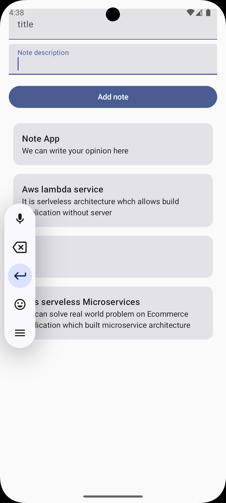

# NoteApp

Simple Android Notes application demonstrating use of Room (local persistence) and Hilt (dependency injection).



## Overview

`NoteApp` is a small Android application for creating, editing, listing, and deleting notes. It is built with a focus on clean architecture principles and uses:

- Room for local data storage (SQLite wrapper)
- Hilt for dependency injection
- Kotlin coroutines / Flow (or LiveData) for async and reactive data flows

This repository contains an `app` module with the Android application. The app shows typical patterns for:

- Defining a Room `Entity`, `Dao`, and `Database`
- Injecting repositories and ViewModels with Hilt
- Performing background DB operations with coroutines

## Features

- Create, update, and delete notes
- List notes ordered by last updated timestamp
- Simple note model including title, body, timestamps, and optional pinning
- Clean separation of data, domain, and presentation layers

## Project structure

- `app/` - Android module with source code
  - `src/main/java/...` - Application, activities/fragments, ViewModels, repositories, DI modules
  - `src/main/res/` - layouts, drawables, strings
  - `build.gradle.kts` - module Gradle configuration

## Room (database)

Typical components you'll find in the project:

- `@Entity` data class: Note (id, title, content, timestamp, isPinned)
- `@Dao` interface: methods for insert, update, delete, and queries (e.g. getAllNotesOrderedByTimestamp)
- `@Database` abstract class: provides NoteDao and database instance

Room is used with Kotlin coroutines/Flow for asynchronous access and updates.

## Hilt (dependency injection)

Hilt is used to provide:

- App-level dependencies (database, DAOs, repositories)
- ViewModel injection for Activities/Fragments

Look for the `@HiltAndroidApp` annotated Application class and `@Module` classes providing Room and repository bindings.

## Prerequisites

- JDK 11 or later
- Android Studio (Arctic Fox or newer recommended)
- Android SDK matching the project's compileSdk

## Build & Run

From the project root you can build the app using the Gradle wrapper (macOS / zsh):

```bash
./gradlew assembleDebug
```

To install and run on a connected device/emulator:

```bash
./gradlew installDebug
```

Or open the project in Android Studio and run the `app` configuration.

## Common dev notes

- Database schema changes: bump Room `version` and provide migrations, or use `fallbackToDestructiveMigration()` only in development.
- Hilt: remember to annotate the Application with `@HiltAndroidApp` and add `hilt-android` and `hilt-compiler` dependencies in Gradle.
- Tests: unit test DAOs using an in-memory Room database; instrumented tests for integration flows.

## Sample Note data model (example)

```kotlin
@Entity(tableName = "notes")
data class Note(
    @PrimaryKey(autoGenerate = true) val id: Long = 0,
    val title: String,
    val content: String,
    val updatedAt: Long = System.currentTimeMillis(),
    val isPinned: Boolean = false
)
```

## Contributing

Contributions are welcome. Please open an issue first for larger changes. Follow standard Android/Kotlin style and add tests for new features where possible.

## License

This project is provided as-is. Add a license file if you plan to redistribute or collaborate publicly.

## Where to look

- `app/src/main/java/.../di/` - Hilt modules and providers
- `app/src/main/java/.../data/` - Room entities, DAOs, and database
- `app/src/main/java/.../ui/` - Activities/Fragments and ViewModels

If you'd like, I can also:

- Expand README with exact dependency snippets for `build.gradle.kts` (Hilt + Room dependencies and Gradle plugin settings)
- Add quick start instructions for tests or CI
- Add code examples for a Repository and ViewModel wired with Hilt

---

If you want this README tuned to your exact code (package names, entity fields, or sample commands), tell me and I will pull those details directly from the source files and update the README accordingly.
# notes_app
